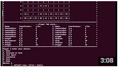

# uni-cplusplus-fantasy-chess
Console based fantasy chess game

### Overview
You will have to create a chess-like strategy game which can be played by two human opponents. The game is played on a 9X9 board consisting of squares in which the pieces can move around. The objective of the game is to kill off your opponent's King piece. This is accomplished by moving your friendly pieces around on the board until you are able to move one of them onto a square containing the enemy King (or cast a damaging spell on the King).

### Video

### Technologies
- C++
- Enterprise Architect (Diagrams)

### Programming Techniques
- OOP
- Design Patterns

### Docs
- [Diagrams](diagrams)
